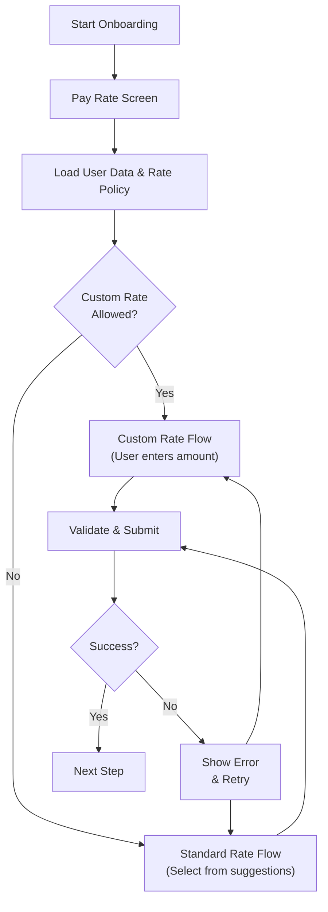
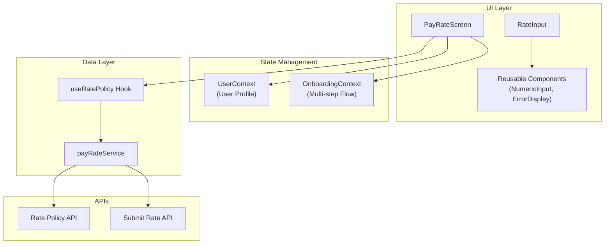

# Homeaglow Pay Rate Solution

## Overview

This solution implements a pay rate setting screen as part of a multi-step onboarding flow for the Homeaglow platform. The implementation demonstrates clean architecture with proper separation of concerns and simple state management.

The pay rate screen is integrated into a comprehensive multi-step onboarding flow. The implementation includes designs for both standard and custom rate flows for new customers, with client-side and server-side validation. Data fetching has been mocked with realistic API delays, and error conditions are simulated for 10% of requests to test error handling scenarios.

Assumptions have been made on the user experience, error handling, flow after and before the continue button... Questions about them at the end of the doc!

## User Flow

The complete user journey through the pay rate setting process follows this simplified flow:



> Please include in it your thoughts on how you would fetch data to populate this screen, error handling, and what you would do when the applicant clicks continue.

### Data fetching

The screen requires two main data sources:

1. **User Profile**: Fetched early in UserContext on app initialization to avoid waterfall requests. Includes user location (state) which determines rate policies.
2. **Rate Policy**: Fetched when PayRateScreen mounts using the `useRatePolicy` hook. Contains state-specific minimum/maximum rates, suggested rates, and custom rate permissions.

In production, I'd consider a GraphQL BFF to batch related queries, though user profile and rate policy have different lifecycles - user data is needed globally while rate policy is step-specific. Background prefetching rate policies during earlier steps could improve UX, but adds complexity and may waste bandwidth if users don't reach the pay rate step.

### Error handling

Error handling is implemented at multiple levels:

1. **Network Errors**: `useRatePolicy` hook handles loading states and provides retry functionality for failed requests
2. **Validation Errors**: Client-side validation for rate bounds with real-time feedback, plus server-side validation in the service layer
3. **UI Error States**: Consistent error display components show user-friendly messages with actionable next steps
4. **Error Simulation**: 10% of rate policy requests randomly fail to test error scenarios

For production, I'd add error boundaries to catch unexpected errors, integrate Sentry for error reporting, and implement proper error categorization for better debugging.

### Click continue

The continue button triggers a validation and submission flow:

1. **Client Validation**: Check if selected rate is within policy bounds
2. **Context Validation**: OnboardingContext validates the complete step data
3. **API Submission**: Submit rate data to backend via `submitPayRate` service
4. **Success Flow**: Save data and automatically progress to next step
5. **Error Flow**: Display errors without navigation, allow user to retry

The OnboardingContext centralizes this logic, making it consistent across all steps. The implementation already includes proper loading states during submission (button shows "Saving..." and is disabled). For production, optimistic updates could further improve perceived performance by immediately showing success states before server confirmation.

## Architecture

This architecture was chosen to balance simplicity with scalability. Context API provides clean state management without the complexity of Redux for a focused onboarding flow. Pure presentation components maximize reusability across the app, while domain-specific components handle business logic. The service layer abstracts API calls, making it easy to switch from mocked to real APIs.

The multi-step flow is centralized in OnboardingContext, which manages step progression, data persistence between steps, and validation. OnboardingFlow provides a consistent UI shell (header, progress bar, continue button) while each step renders its specific content. This pattern makes it easy to add new steps or modify the flow without touching individual step components.



### Core Principles

- **Separation of Concerns**: Clear boundaries between presentation, business logic, and data layers
- **Context-Driven State**: Eliminates prop drilling while maintaining performance
- **Reusable Components**: Pure presentation components for maximum reusability
- **Service Layer**: Centralized API interactions and business rules

## Implementation Details

### State Management

- **UserContext**: Global user profile loaded on app initialization
- **OnboardingContext**: Multi-step flow orchestration

### Component Architecture

**Pure Presentation Components** (`src/ui/components/`):

- `NumericInput`: Domain-agnostic +/- input, reusable for any numeric value
- `ProgressBar`: Dynamic progress visualization
- `ErrorDisplay`: Consistent error messaging

**Domain-Specific Components**:

- `RateInput`: Combines NumericInput with rate-specific validation and recommendations
- `PayRateScreen`: Orchestrates step logic and handles state-specific UI variants

### Service Layer

- `payRateService.ts`: Mock API with realistic delays and state-specific policies
- `useRatePolicy`: Data fetching hook with loading states and error recovery

## State-Specific Implementation

Simple conditional rendering based on state policy:

```typescript
{policy?.hasCustomRatePolicy ? (
  <CustomNewClientRate />
) : (
  <StandardNewClientRate />
)}
```

This conditional works fine for a screen with just 2 different flows, more complex conditions would probably require State specific components or entire screens for maintainability

## Future Improvements

### Immediate Priorities

1. Focus on accessibility
2. Implement error boundaries and error reporting throughout the app
3. Set up analytics and A/B testing
4. **Testing**: Component, integration, and performance testing
5. Extract more reusable UI components (Toggle, RateDisplay)
6. Review performance (rerenders, bundle size...)

### Medium-term Enhancements

1. **Data Layer**: consider GraphQL BFF for efficient data fetching and caching
2. **State Management**: Apollo Client for server data, Zustand for lightweight global state
3. **API Evolution**: real-time updates, offline support

## Questions for Better Solution Design

### Product & Business Logic

- What factors determine job estimates (location, competition, seasonality)?
- What analytics events are most valuable for product decisions?

- Are there GDPR or other privacy compliance requirements?
- Do we expect to support other locales?
- Do we expect to support other countries?
- Do we expect to support other currencies?

### User Experience

- What happens when users go back and forth between steps - should data persist?
- Should rate recommendations be personalized based on user profile/location?
- How should we handle users who set rates outside recommended ranges?
- What's the expected user journey after completing this step?
- Are there accessibility requirements beyond standard compliance?
- Should the UI adapt differently for tablet vs mobile?

### Technical Architecture

- What's the expected scale (concurrent users, geographic distribution)?

### Data & Integration

- What user data is available from previous steps or existing systems?
- Are there real-time requirements for rate policy updates?
- How should we handle offline scenarios?
